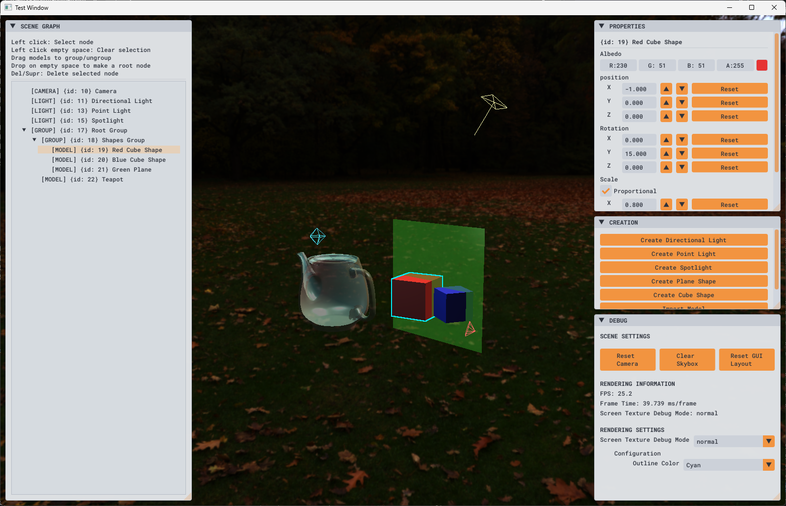
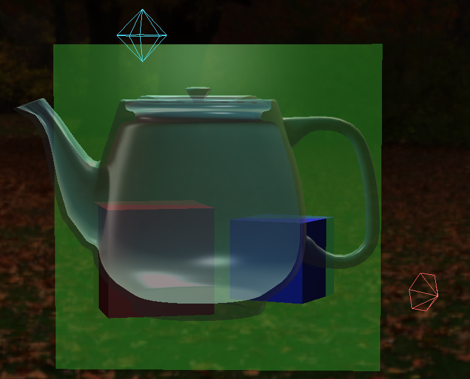
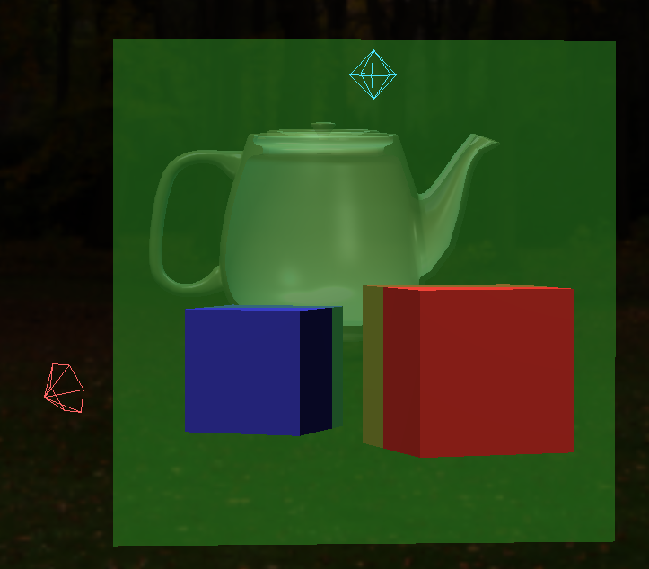
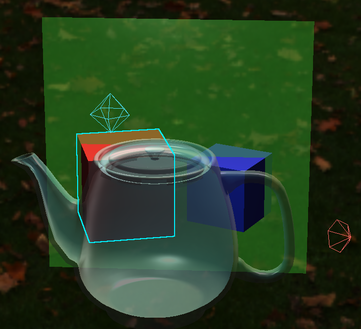
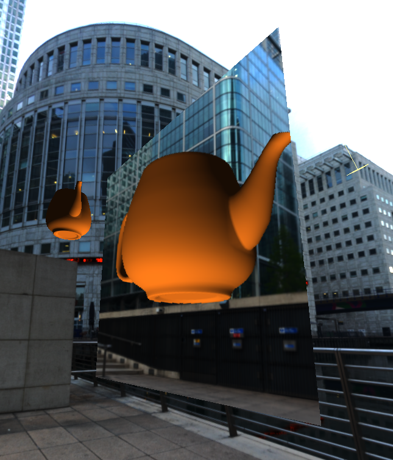
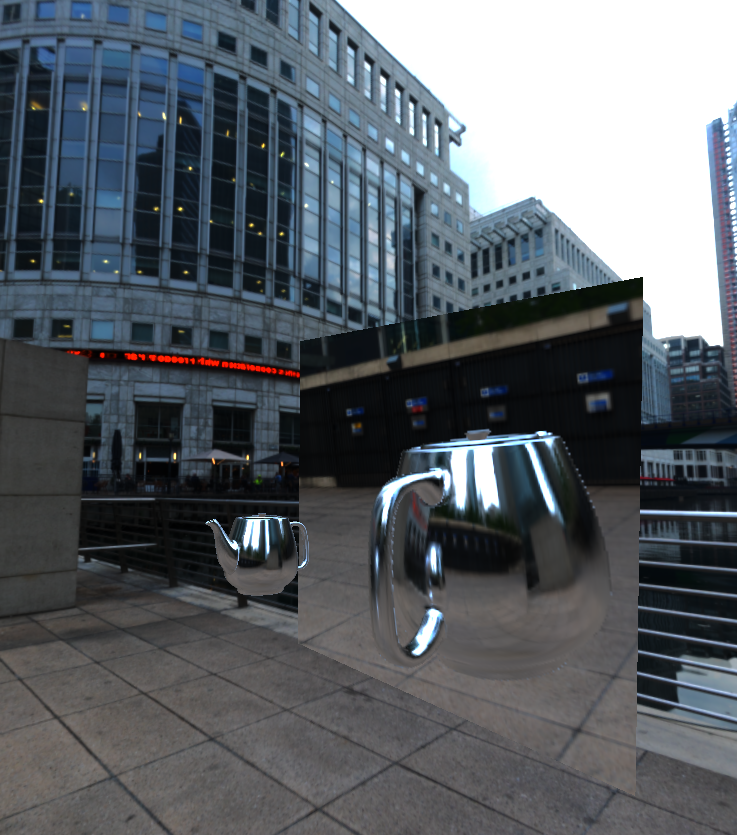
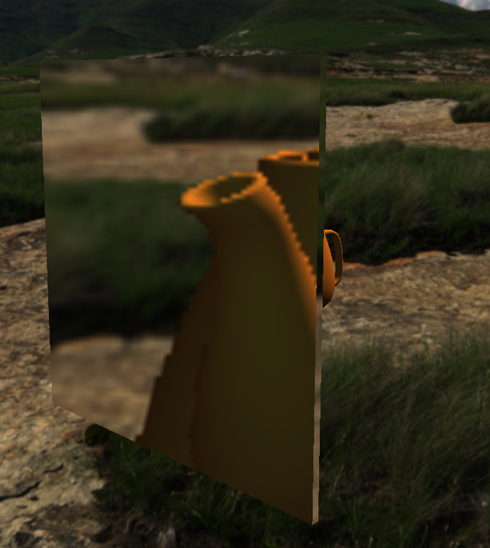
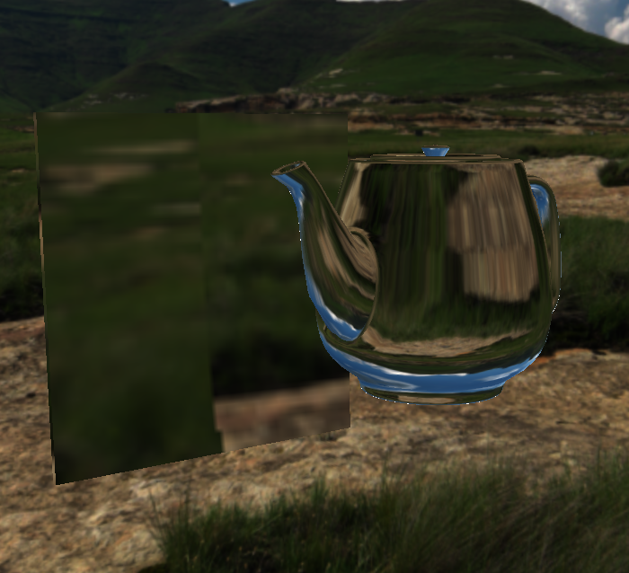

# OpenGL Graphics Engine

[](https://isocpp.org/)
[](https://www.opengl.org/)
[](https://cmake.org/)
[](https://opensource.org/licenses/MIT)

A **modular, extensible 3D graphics engine** built from scratch with OpenGL 4.2. Initially developed as a Bachelor's Thesis (TFG), it serves as a lightweight prototyping platform for real-time rendering, featuring a composite scene graph, lighting, model import, an immediate-mode GUI editor, among other functionalities.

---

## Features

- **Scene Graph & Composite Pattern** - Hierarchical node system with transform inheritance, grouping, and drag-and-drop reparenting in the GUI.
- **Lighting** - Point lights, spotlights, and directional lights with editable parameters (colour, intensity, attenuation, cut-off angles) and visual gizmos.
- **Model Import** - Load 3D models (`.obj`, `.gltf`, `.fbx`, etc.) via **Assimp**.
- **Skyboxes** - HDR environment maps and custom cubemap loading (six face images).
- **Reflection & Refraction** - Dynamic per-object environment maps with ping-pong buffering to avoid recursion.
- **Transparency & Blending** - Alpha channel support with back-to-front sorting for correct blending.
- **Colour Picking & Outlining** - Click-to-select objects using off-screen colour encoding; selected objects are highlighted with a depth-aware outline.
- **ImGui Editor** - Rich GUI panels:
  - *Scene Graph* - tree view with drag-and-drop reparenting.
  - *Properties* - real-time editing of transforms, colour, opacity, light parameters, etc.
  - *Debug* - visualisation modes (Normal, Inverted Colours, Picking Colours, Grid Overlay) and performance stats.
  - *Creation* - instantiate primitives (cube, sphere, cylinder, cone, plane) or import models/skyboxes.
- **Efficient Event-Driven Loop** - Blocks on idle using `glfwWaitEvents()`, reducing CPU usage to near zero when inactive.

---

## Architecture Overview

The engine is split into two CMake modules:

| Module | Description |
| ------ | ----------- |
| **`core`** | Static library containing all rendering logic, scene management, shaders, and resource handling. Dependencies: OpenGL, GLAD, GLM, stb_image, Assimp. |
| **`app`** | Executable that provides the window, input handling, and GUI (GLFW, ImGui). It instantiates the `core` and demonstrates its usage. |

This separation allows the `core` to be reused in other projects without pulling GUI or windowing dependencies.

For a detailed class diagram and pipeline description, see the [Architecture Guide](docs/architecture.md).

---

## Dependencies

| Library | Version | Purpose |
| ------- | ------- | ------- |
| OpenGL | 4.2 Core | Graphics API |
| GLFW | 3.4 | Window creation, input, context |
| GLAD | 0.1.36 | OpenGL extension loading |
| GLM | 0.9.8.5 | Vector/matrix mathematics |
| stb_image | 2.30 | Image loading (`.jpg`, `.png`, etc.) |
| Dear ImGui | 1.91.6 | Immediate-mode GUI |
| Assimp | 6.0.2 | 3D model import |

CMake (≥3.20) with Ninja generator is recommended, but any generator works.

---

## Building

See the detailed [Build Instructions](docs/build_instructions.md) for platform-specific steps. In short:

```bash
# Configure with Ninja
cmake -S . -B build -G Ninja -DCMAKE_BUILD_TYPE=Release

# Build
cmake --build build --config Release

# Run
./build/bin/App.exe
```

---

## Usage

- **Camera** - Drag with right mouse button to orbit, scroll to zoom.
- **Select** - Left-click on any renderable object to select it (outline appears). Double-click to select the parent group.
- **GUI Panels** - All panels are draggable, resizable, and collapsible.
  - *Scene Graph* - drag nodes to reparent; drop on the bottom area to make the node a root.
  - *Properties* - modify transforms, colour, opacity, light parameters, etc.
  - *Creation* - create new lights, primitives, or import models/skyboxes.
  - *Debug* - switch visualisation modes and reset GUI layout.

---

## Screenshots

| Feature | Example Screenshot |
| ------- | ------------------ |
| **Window - Scene & GUI Editor** | <div style="display:flex; justify-content:center; align-items:center; flex-wrap:wrap; gap:20px;">  </div>|
| **Blending & Transparency** | <div style="display:flex; justify-content:center; align-items:center; flex-wrap:wrap; gap:20px;">   </div> |
| **Outlining** | <div style="display:flex; justify-content:center; align-items:center; flex-wrap:wrap; gap:20px;">   </div> |
| **Reflection** | <div style="display:flex; justify-content:center; align-items:center; flex-wrap:wrap; gap:20px;">  </div> |
| **Refraction** | <div style="display:flex; justify-content:center; align-items:center; flex-wrap:wrap; gap:20px;">  </div> |

See other captures in the subfolder [Images](docs/images/)

---

## Current Status

This engine is a **beta prototype** (v0.8.0) - functional and usable, but not production-ready. Known limitations include:

- No instanced rendering or frustum culling (performance drops with >1000 opaque objects).
- Transparent objects become expensive (>500 objects).
- Dynamic environment maps are computationally heavy (>10 reflective objects).
- Shader/material assignment is hard-coded (no data-driven material system).
- Limited animation and material import from Assimp.

See the full [Limitations and Known Issues](docs/limitations.md) document for a comprehensive list.

---

## Future Roadmap

Short-term optimisations (instancing, frustum culling, order-independent transparency) and longer-term features (data-driven materials, full Assimp support, multi-camera, post-processing, PBR) are outlined in the [Future Work](docs/future_work.md) document.

---

## License

This project is distributed under the **MIT License**. See the [LICENSE](LICENSE) file for details. All images and documentation are likewise covered by the MIT License.
