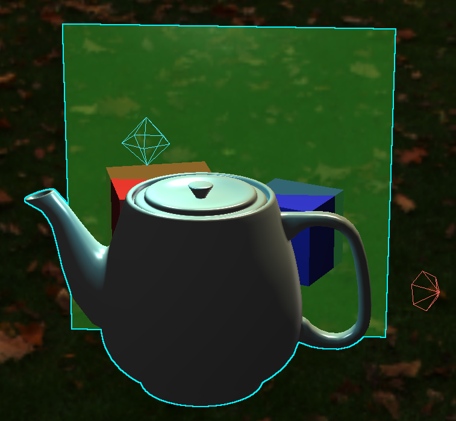

# OpenGL 4.5 based Graphics Engine

[](https://isocpp.org/)
[](https://www.opengl.org/)
[](https://github.com/emartg/opengl-graphics-engine/actions/workflows/ci.yml)
[](https://cmake.org/)
[](https://opensource.org/licenses/MIT)

A **modular, extensible 3D graphics engine** built from scratch with OpenGL 4.5. Initially developed as a Bachelor's Thesis (TFG), it serves as a lightweight prototyping platform for real-time rendering, featuring a composite scene graph, lighting, model import, an immediate-mode GUI editor, among other functionalities.

---

## Features

- **Scene Graph & Composite Pattern** - Hierarchical node system with transform inheritance, grouping, and drag-and-drop reparenting in the GUI.
- **Lighting** - Point lights, spotlights, and directional lights with editable parameters (color, intensity, attenuation, cut-off angles) and visual gizmos.
- **Model Import** - Load 3D models (`.obj`, `.gltf`, `.fbx`, etc.) via **Assimp**.
- **Skyboxes** - HDR environment maps and custom cubemap loading (six face images).
- **Reflection & Refraction** - Dynamic per-object environment maps with ping-pong buffering to avoid recursion.
- **Transparency & Blending** - Alpha channel support with back-to-front sorting for correct blending.
- **Color Picking & Outlining** - Click-to-select objects using off-screen color encoding; selected objects are highlighted with a depth-aware outline.
- **ImGui Editor** - Rich GUI panels:
  - *Scene Graph* - tree view with drag-and-drop reparenting.
  - *Properties* - real-time editing of transforms, color, opacity, light parameters, etc.
  - *Debug* - visualisation modes (Normal, Inverted Colors, Picking Colors, Grid Overlay) and performance stats.
  - *Creation* - instantiate primitives (cube, sphere, cylinder, cone, plane) or import models/skyboxes.
- **Efficient Event-Driven Loop** - Blocks on idle using `glfwWaitEvents()`, reducing CPU usage to near zero when inactive.
- **Rendering Performance** - Frustum culling, geometries shared between identical meshes, instanced rendering of repeated shapes, and a shader storage buffer for any number of lights.
- **Reusable Libraries** - `Engine::Core` and `Engine::Platform` can be consumed by other CMake projects (e.g., as a Git submodule).
- **Cross-Platform Builds & CI** - Windows (MSVC, MinGW) and Linux (GCC, Clang) builds, checked by GitHub Actions on every pull request and push to `main` (unit tests on both platforms, smoke tests on Linux).

---

## Architecture Overview

The engine is split into three CMake modules:

| Module | Description |
| ------ | ----------- |
| **`core`** | Static library containing all rendering logic, scene management, shaders, and resource handling. Dependencies: OpenGL, GLAD, GLM, stb_image, Assimp, nlohmann/json. |
| **`platform`** | Static library providing the reusable window, input, and ImGui integration layer. It depends on `core`, GLFW, ImGui, and ImGuiFileDialog. |
| **`app`** | Executable containing the scene editor and example scenes. It depends on `platform` (and receives `core` transitively). |

This separation allows the `core` to be reused in other projects without pulling GUI or windowing dependencies, while applications that need a window can reuse `platform`.

For a detailed class diagram and pipeline description, see the [Architecture Guide](docs/architecture.md).

---

## Dependencies

| Library | Version | Purpose |
| ------- | ------- | ------- |
| OpenGL | 4.5 Core | Graphics API |
| GLFW | 3.5.1 | Window creation, input, context |
| GLAD | 0.1.36 | OpenGL extension loading |
| GLM | 1.0.3 | Vector/matrix mathematics |
| stb_image | 2.30 | Image loading (`.jpg`, `.png`, etc.) |
| Dear ImGui | 1.91.6 | Immediate-mode GUI |
| Assimp | 6.0.5 | 3D model import |
| nlohmann/json | 3.12.0 | JSON parsing (shader descriptors) |

On Windows, GLFW, GLM, Assimp, and nlohmann/json are built by [vcpkg](https://github.com/microsoft/vcpkg) from the `vcpkg.json` manifest (the versions above); on Linux, the versions of the system packages are used.

CMake (≥3.21, or ≥3.25 to use the presets) with the Ninja generator is recommended, but any generator works.

---

## Building

See the detailed [Build Instructions](docs/build_instructions.md) for platform-specific steps. In short:

```bash
# Configure the default Ninja/MSVC x64 Debug preset (vcpkg builds the dependencies on the first configuration)
cmake --preset ninja-msvc-debug

# Build App and its dependencies
cmake --build --preset ninja-msvc-debug

# Run (resources are located automatically, whatever the working directory)
./out/build/ninja-msvc-debug/bin/App.exe
```

In VS Code, install **CMake Tools** and **C/C++**, select the `Ninja MSVC x64 + vcpkg Debug` or `Ninja MSVC x64 + vcpkg Release` configure preset, configure the project, set `App` as the build target, and use **CMake: Build** or the `Debug App (CMake)` launch configuration. Visual Studio uses the same presets from `CMakePresets.json`, while native Visual Studio or other generators use their own descriptive build directory. See the [Build Instructions](docs/build_instructions.md) for the complete IDE and CLI workflows.

Every Windows preset uses vcpkg: the dependencies are declared in `vcpkg.json` (vcpkg manifest mode), so vcpkg builds and installs them during the first configuration (`x64-windows` triplet with MSVC, `x64-mingw-dynamic` with MinGW). Before configuring, clone and bootstrap [vcpkg](https://github.com/microsoft/vcpkg), and set `VCPKG_ROOT` (and, for MinGW, `MINGW_ROOT`) as user environment variables:

```powershell
[Environment]::SetEnvironmentVariable("VCPKG_ROOT", "C:\path\to\vcpkg", "User")
[Environment]::SetEnvironmentVariable("MINGW_ROOT", "C:\path\to\mingw64", "User")
```

Restart VS Code after changing these variables. For MinGW, use the `mingw-gcc-vcpkg-debug` or `mingw-gcc-vcpkg-release` preset, which use the MinGW Makefiles generator and GCC. In a new ordinary PowerShell terminal, configure and build with:

```powershell
$env:Path = "$env:MINGW_ROOT\bin;$env:Path"
$env:VCPKG_ROOT = [Environment]::GetEnvironmentVariable("VCPKG_ROOT", "User")
cmake --fresh --preset mingw-gcc-vcpkg-debug
cmake --build --preset mingw-gcc-vcpkg-debug --parallel
```

Use the release preset for Release builds. If CMake reports that GLFW or Assimp is missing, verify that `VCPKG_ROOT` points to an up-to-date vcpkg Git clone that contains the `builtin-baseline` commit of `vcpkg.json`, then reconfigure with `cmake --fresh`. A Visual Studio Developer PowerShell may set `VCPKG_ROOT` to the vcpkg instance of Visual Studio; restore your own with `$env:VCPKG_ROOT = [Environment]::GetEnvironmentVariable("VCPKG_ROOT", "User")`.

Alternatively, build directly with CMake from a Visual Studio Developer PowerShell. Keep manual builds under `out/build/` and use a fresh directory when changing compilers or generators:

```powershell
cmake -S . -B out/build/manual-ninja-msvc-release -G Ninja `
  -DCMAKE_BUILD_TYPE=Release `
  -DCMAKE_C_COMPILER=cl `
  -DCMAKE_CXX_COMPILER=cl `
  -DCMAKE_TOOLCHAIN_FILE="$env:VCPKG_ROOT/scripts/buildsystems/vcpkg.cmake" `
  -DVCPKG_TARGET_TRIPLET=x64-windows
cmake --build out/build/manual-ninja-msvc-release --parallel
out/build/manual-ninja-msvc-release\bin\App.exe
```

For Debug, change `Release` to `Debug` and use a separate directory such as `out/build/manual-ninja-msvc-debug`. The preset and direct CLI workflows are equivalent; presets simply keep the default configuration choices in the repository.

On Linux, install GLFW, Assimp, GLM, and nlohmann/json from the system package manager
and use the GCC or Clang presets (`ninja-gcc-debug`, `ninja-clang-debug`, and their Release variants):

```bash
sudo apt install build-essential clang ninja-build cmake libglfw3-dev libassimp-dev libglm-dev nlohmann-json3-dev libgl-dev
cmake --preset ninja-gcc-debug
cmake --build --preset ninja-gcc-debug
./out/build/ninja-gcc-debug/bin/App
```

The Engine can also be consumed by other CMake projects (e.g., as a Git submodule)
with `add_subdirectory()` and the `Engine::Core` target; see [Using the Engine from
Another CMake Project](docs/build_instructions.md#using-the-engine-from-another-cmake-project).

---

## Usage

- **Camera** - Drag with right mouse button to orbit, scroll to zoom.
- **Select** - Left-click on any renderable object to select it (outline appears). Double-click to select the parent group.
- **GUI Panels** - All panels are draggable, resizable, and collapsible.
  - *Scene Graph* - drag nodes to reparent; drop on the bottom area to make the node a root.
  - *Properties* - modify transforms, color, opacity, light parameters, etc.
  - *Creation* - create new lights, primitives, or import models/skyboxes.
  - *Debug* - switch visualisation modes and reset GUI layout.

---

## Screenshots

| Feature | Example Screenshot |
| ------- | ------------------ |
| **Window - Scene & GUI Editor** | <div style="display:flex; justify-content:center; align-items:center; flex-wrap:wrap; gap:20px;">  </div> |
| **Blending & Transparency** | <div style="display:flex; justify-content:center; align-items:center; flex-wrap:wrap; gap:20px;">   </div> |
| **Outlining** | <div style="display:flex; justify-content:center; align-items:center; flex-wrap:wrap; gap:20px;">   </div> |
| **Reflection** | <div style="display:flex; justify-content:center; align-items:center; flex-wrap:wrap; gap:20px;">  </div> |
| **Refraction** | <div style="display:flex; justify-content:center; align-items:center; flex-wrap:wrap; gap:20px;">  </div> |

See other captures in the subfolder [Images](docs/images/).

---

## Current Status

This engine is a **beta prototype** (v0.9.0) - functional and usable, but not production-ready. Known limitations include:

- No shadows, normal mapping, or physically based materials yet.
- Transparent objects become expensive (>500 objects).
- Dynamic environment maps are computationally heavy (>10 reflective objects).
- Shader/material assignment is hard-coded (no data-driven material system).
- Limited animation and material import from Assimp.

See the full [Limitations and Known Issues](docs/limitations.md) document for a comprehensive list, and the [Changelog](CHANGELOG.md) for the changes of each version.

---

## Future Roadmap

The planned releases (data-driven materials, deferred shading and shadows, normal mapping and PBR, order-independent transparency and particles, editor improvements) and longer-term features are outlined in the [Future Work](docs/future_work.md) document. The development and release process is described in the [Development Workflow](docs/development_workflow.md) document.

---

## License

This project is distributed under the **MIT License**. See the [LICENSE](LICENSE) file for details. All images and documentation are likewise covered by the MIT License.
