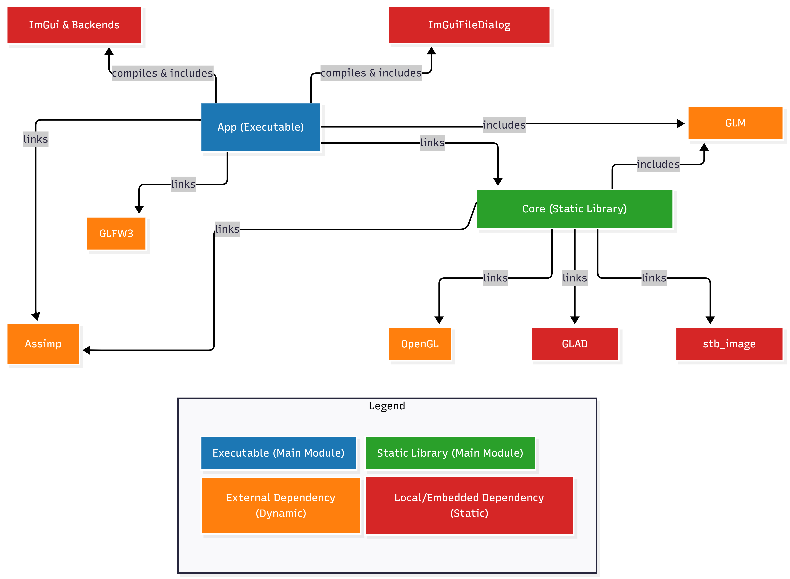
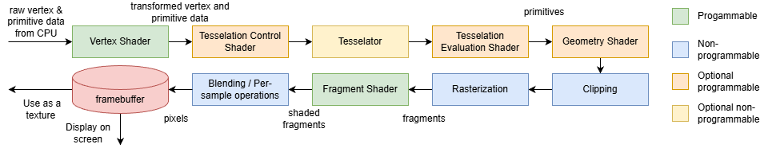
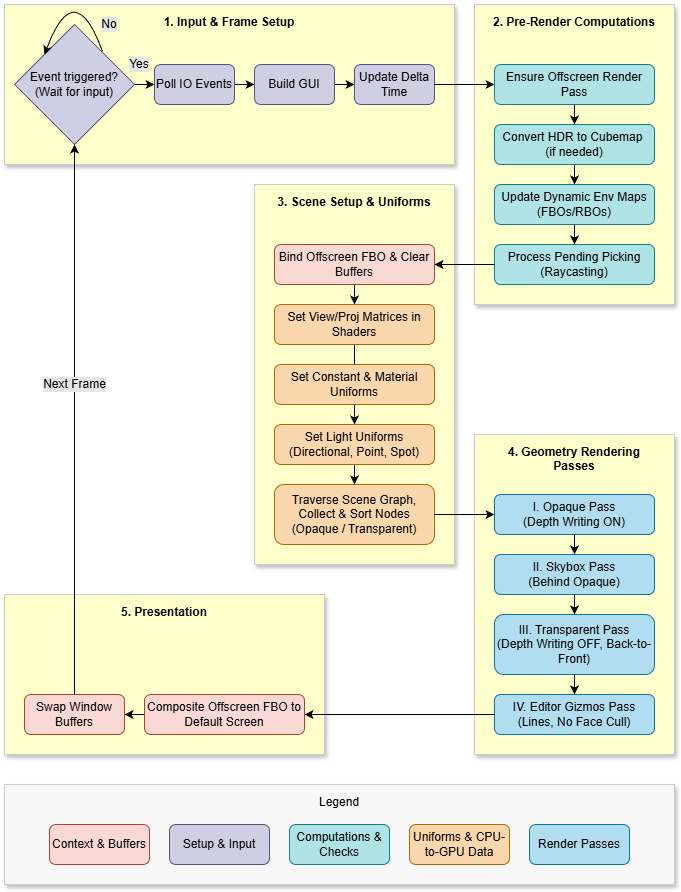
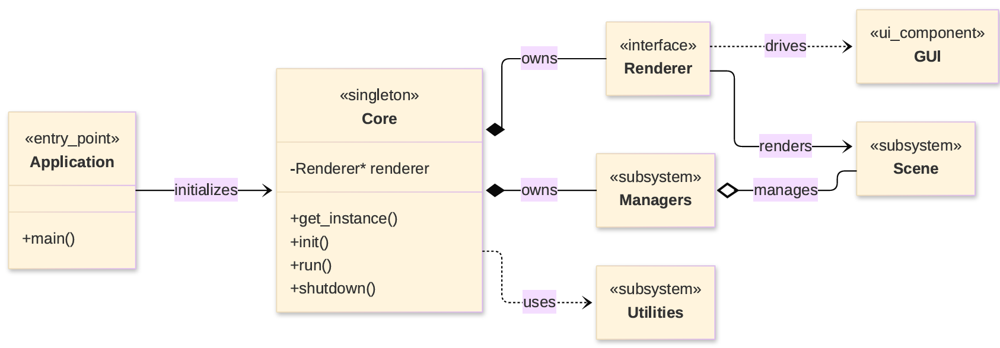
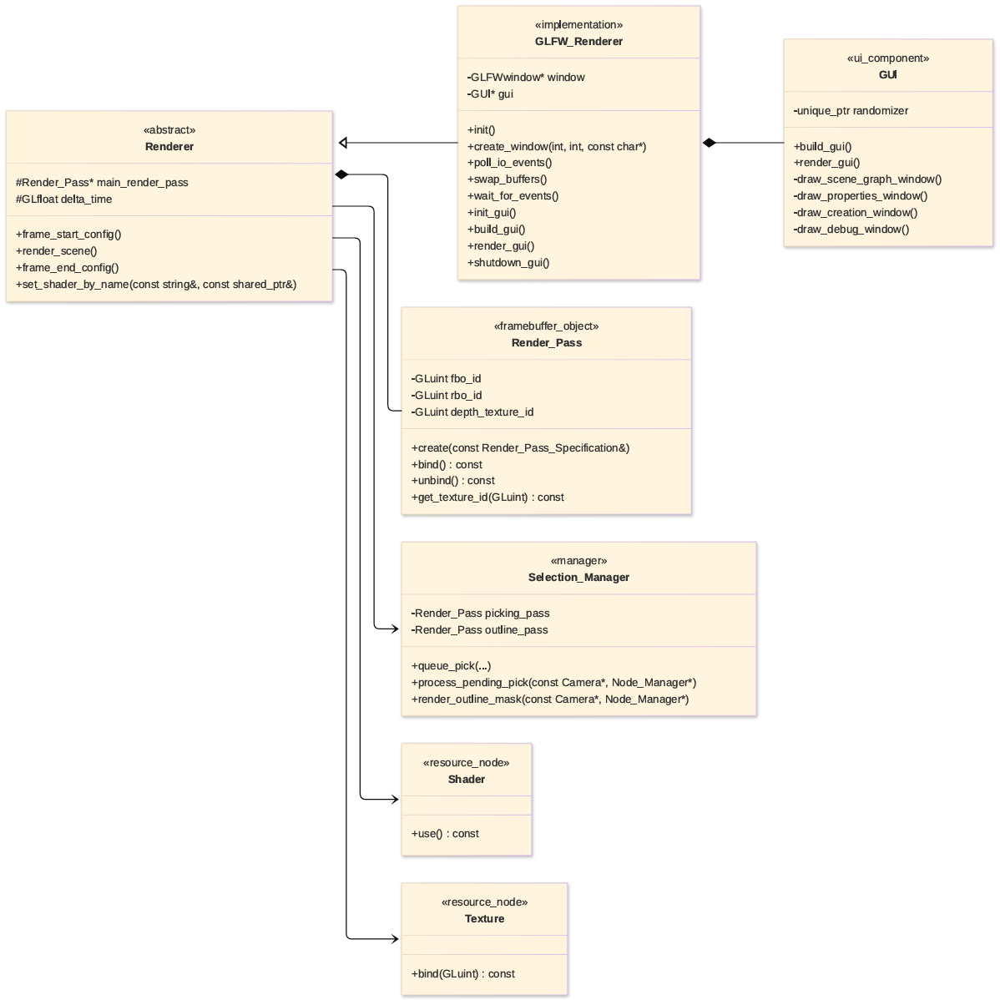
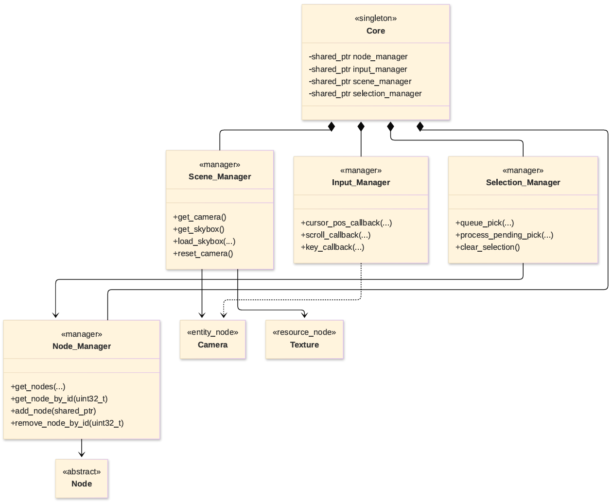
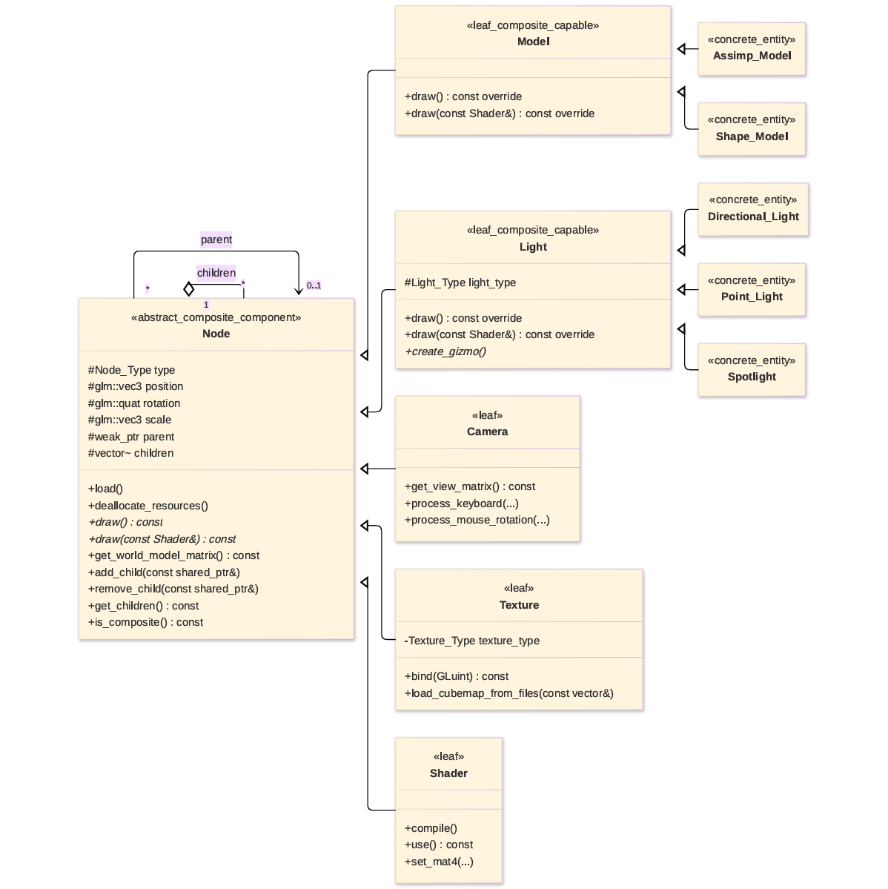
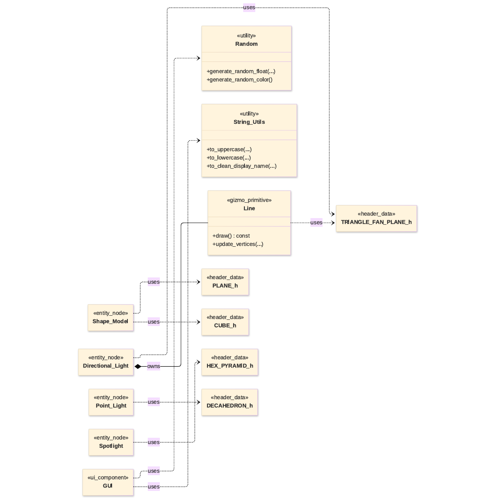

# Architecture Guide

This document provides an overview of the engine's internal design.

## Modules and Separation

The project is split into three top-level modules:

1. **`core` (static library)** - Platform-agnostic rendering engine. It contains:
   - The scene graph and node system.
   - Render pipeline logic.
   - Resource management (textures, shaders, buffers).
   - Mathematical utilities and geometry primitives.
   - Dependencies: OpenGL, GLAD, GLM, stb_image, Assimp.

2. **`platform` (static library)** - Platform layer, reusable by any application that needs a window. It contains:
   - Window creation and context management (`GLFW_Renderer`, the GLFW implementation of `Renderer`).
   - Input event handling (callbacks).
   - The ImGui context and its GLFW and OpenGL backends.
   - The `Gui_Layer` interface, implemented by each application to draw its own ImGui windows.
   - Dependencies: `core`, GLFW, ImGui, ImGuiFileDialog.

3. **`app` (executable)** - Sample application (scene editor). It contains:
   - The example and test scenes.
   - The ImGui editor interface (`GUI`, a `Gui_Layer`).
   - Dependencies: `platform`.

This strict separation means the `core` can be linked into other applications (e.g., a simulation or scientific visualiser) without pulling in GLFW or ImGui, and that applications which need a window reuse the `platform` library instead of duplicating it.
The following diagram (Fig. 1) shows the dependencies between the different modules and libraries in the project:

<i>Fig 1. Dependencies and packages</i>

## Render Pipeline

<i>Fig 2. OpenGL 4 rendering pipeline</i>

The engine follows a structured, custom, multi-pass pipeline every frame based on the OpenGL 4 rendering pipeline represented in the diagram above (Fig. 2). The 5-phase sequence is designed to ensure correctness (depth, blending, environment capture) and performance. The diagram below (Fig. 3) details how the custom rendering sequence is arranged.

<i>Fig 3. Custom rendering pipeline</i>

Next, each phase is described step-by-step.

### Phase 1: Input & Frame Setup

- Waits for events using `glfwWaitEvents()` (blocks when idle) or `glfwWaitEventsTimeout(1/60)` (throttled active rendering).
- Polls I/O events.
- Builds the ImGui interface state.
- Computes delta time.

### Phase 2: Pre-Render Computations

- Ensures the off-screen framebuffer (FBO) exists and matches the window size.
- Converts HDR skybox images to cubemaps if needed.
- Updates dynamic environment maps for reflective/refractive models (captures six faces per object).
- Processes any pending color-picking queries.

### Phase 3: Scene Setup & Uniforms

- Binds the off-screen FBO and clears color/depth/stencil buffers.
- Injects view and projection matrices into shaders.
- Injects light data (arrays of uniforms for point, spot, directional lights).
- Traverses the scene graph, flattens it into a linear list, and splits objects into opaque and transparent lists. Transparent objects are sorted back-to-front.

### Phase 4: Geometry Rendering Passes

- **Opaque Pass** - Renders all opaque nodes (depth write enabled).
- **Skybox Pass** - Renders the environment cubemap.
- **Transparent Pass** - Renders translucent nodes (depth write disabled, depth test enabled, blending active).
- **Gizmos Pass** - Renders light gizmos and directional light arrows (wireframe mode, culling disabled).

### Phase 5: Presentation

- Composites the off-screen FBO to the default framebuffer (allows debug overlays and post-processing).
- Swaps window buffers using `glfwSwapBuffers()`.

## Key Classes

- **`Core`** - Singleton orchestrator. Initialises subsystems, manages the main loop, and delegates responsibilities.
- **`Renderer`** - Abstract interface for rendering. `GLFW_Renderer` (in `platform`) is the concrete GLFW implementation.
- **`Node`** - Base class for all scene entities. Implements the **Composite pattern** (parent-child hierarchy). Contains transform logic (position, rotation, scale) and virtual methods (`load()`, `draw()`, `deallocate_resources()`).
- **`Render_Pass`** - Encapsulates off-screen framebuffer management (FBO, attachments, resolution). Used for color picking and environment map captures.
- **Managers** - Dedicated services:
  - `Scene_Manager` - holds the root node.
  - `Node_Manager` - stores and retrieves nodes by ID.
  - `Selection_Manager` - handles color-picking and outlining.
  - `Input_Manager` - translates raw input to camera/UI actions.
- **`Light`** - Abstract base for directional, point, and spot lights. Each light owns a visual gizmo (wireframe shape) that is rendered in the gizmo pass.

The following UML class diagrams (Figs. 4-8) detail the package layout, class hierarchies, and subsystem relationships.

 
 

<i>Fig 4. Architecture Overview</i>

<i>Fig 5. Rendering & GUI Subsystem</i>

<i>Fig 6. Managers Subsystem</i>

<i>Fig 7. Scene Entities Subsystem</i>

<i>Fig 8. Utilities and Geometry Data</i>

