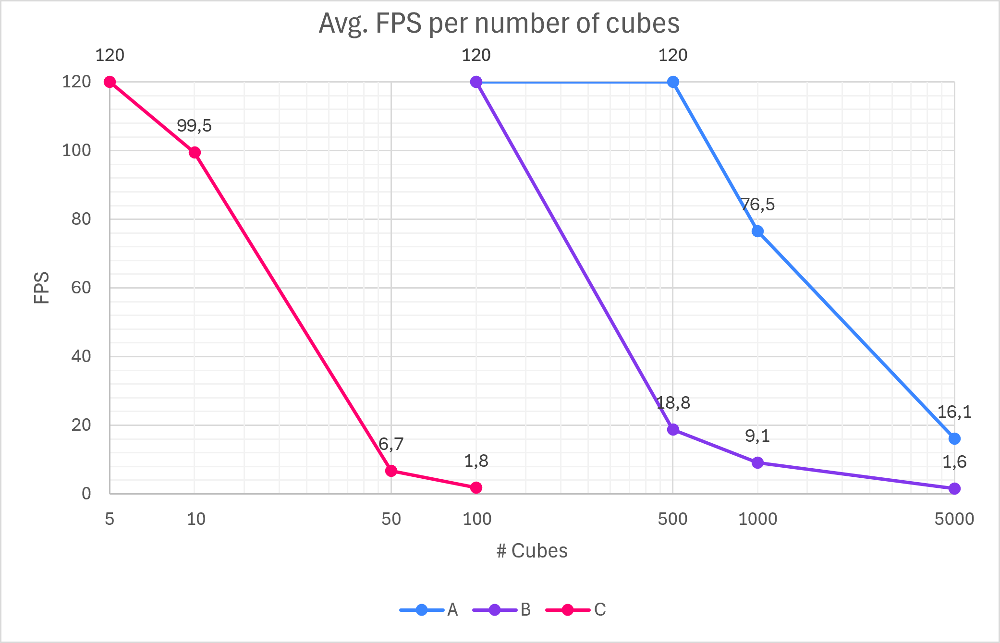
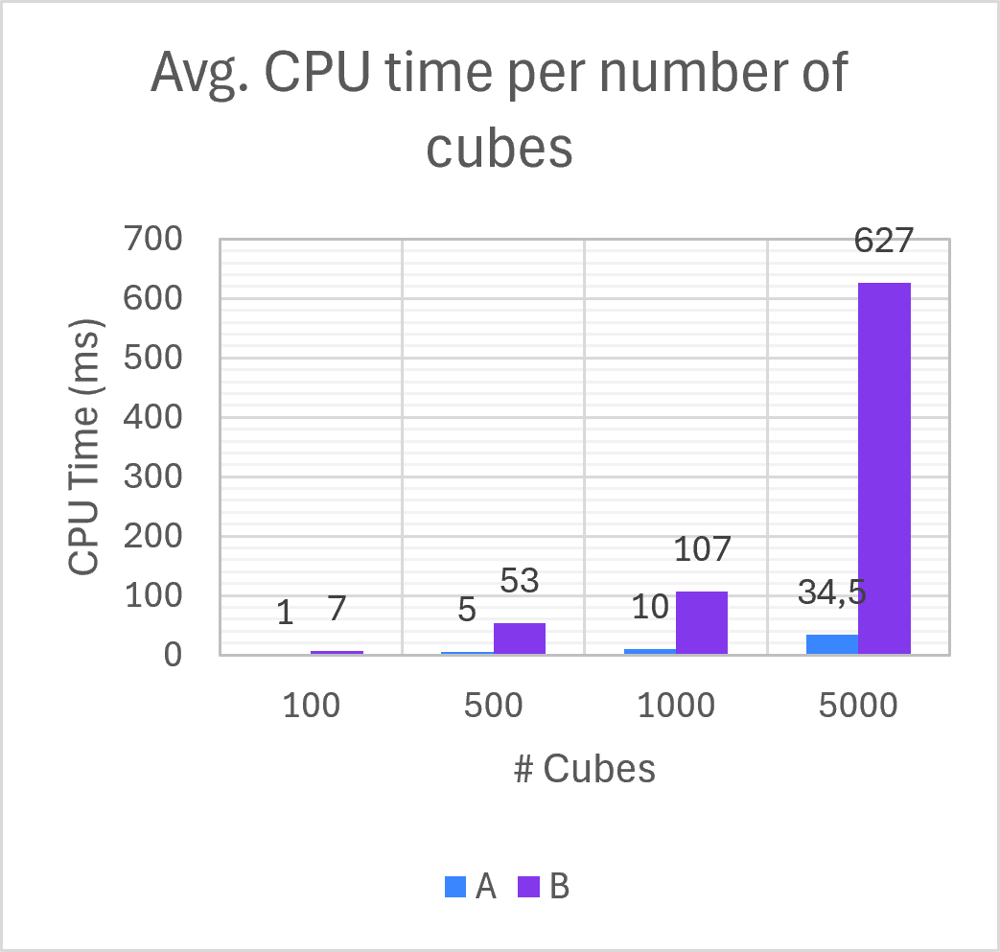
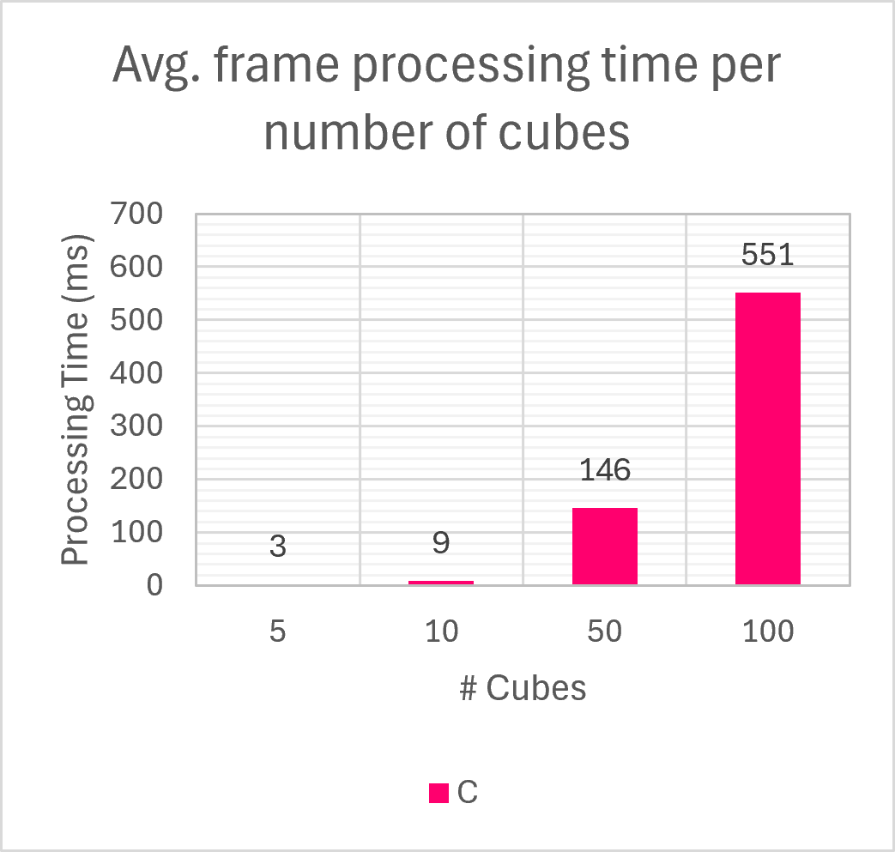

# Limitations and Known Issues

As of version **v0.9.0**, the engine is functional but has several known constraints. These are grouped into architectural and performance limitations.

## Architectural Limitations

| Limitation | Description | Affected Areas |
| ---------- | ----------- | -------------- |
| **Incomplete Material System** | Materials are loaded from descriptor files, assigned to objects, and created, edited, and saved from the Material Editor at runtime, but they cannot be deleted, and the shader of a material cannot be changed. Whether a shader supports instanced rendering or samples an environment map is declared by its materials (a new material copies it from the first material of its shader), not by the shader. | Flexibility, extensibility. |
| **Limited Assimp Import** | Assimp is used only for static geometry extraction. Animations, bones, morph targets, and complex material maps (normals, specular, etc.) are not imported. Some embedded textures fail to load. | Model import quality. |
| **No Shadows** | Lights are evaluated without shadow mapping. Shadow maps, point shadows, and cascaded maps are not implemented. | Visual realism. |
| **Rotation Instability** | *Y-axis rotation ghosting* and *rotation axis coupling* appear due to quaternion-Euler conversions, causing abrupt jumps when rotating in certain orientations. | Usability. |
| **Residual Flicker** | In dense reflective/refractive scenes, minor flicker can persist on environment maps, despite ping-pong buffering mitigation. | Visual quality. |
| **Limited Automated Tests** | Unit tests cover the utilities and geometry classes, and a smoke test checks that the App renders without errors, but the rendered images are not compared automatically (rendering changes are still validated manually). | QA, regression prevention. |
| **No macOS Support** | Windows and Linux are supported and built by the CI. macOS only provides OpenGL up to 4.1, below the required 4.5. | Portability. |

## Performance Limitations

| Limitation | Scenario | Impact |
| ---------- | -------- | ------ |
| **Draw Call Bottleneck** | Opaque objects (Scenario A). Since v0.9.0, the objects outside the view are culled and repeated untextured shapes are drawn with instancing, while the remaining objects (textured, two-sided, or imported models) still issue individual draw calls. | ~120 FPS at 1000 and ~28 FPS at 5000 with culling and instancing (~76 and ~16 FPS before v0.9.0). |
| **Blending Overhead** | Transparent objects (Scenario B). Back-to-front sorting adds `O(n log n)` CPU cost, while blending increases fragment operations (overdraw). | >500 transparent objects becomes impractical (~19 FPS at 500, ~9 FPS at 1000). |
| **Dynamic Environment Maps** | Reflective/refractive objects (Scenario C). Each object renders the entire scene six times per frame for its cubemap. | >10 reflective objects tanks performance (~99 FPS at 10, ~7 FPS at 50). |

The following charts allow for a visualization of these disparities based on the data retrieved for v0.8.0 (before frustum culling and instancing):

  

   

## Missing Features (Unfulfilled Objectives)

The following objectives from the thesis plan were not implemented due to time and health constraints:

- Multiple selection of non-sibling nodes.
- Direct manipulation gizmos (translate/rotate/scale widgets in the viewport).
- Post-processing (anti-aliasing, gamma correction, HDR, bloom) and deferred shading.
- Multi-camera support.
- Procedural generation and particle systems (geometry/compute shaders).
- Advanced window adaptation (fullscreen mode, embedded mode, custom icon, console hiding).

For planned improvements to address these, see the [Future Work](future_work.md) document.
